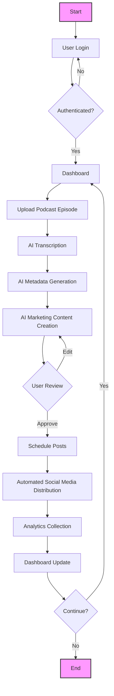
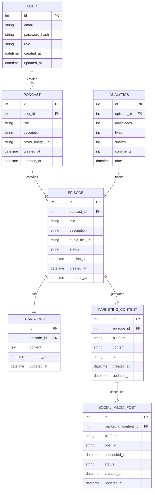
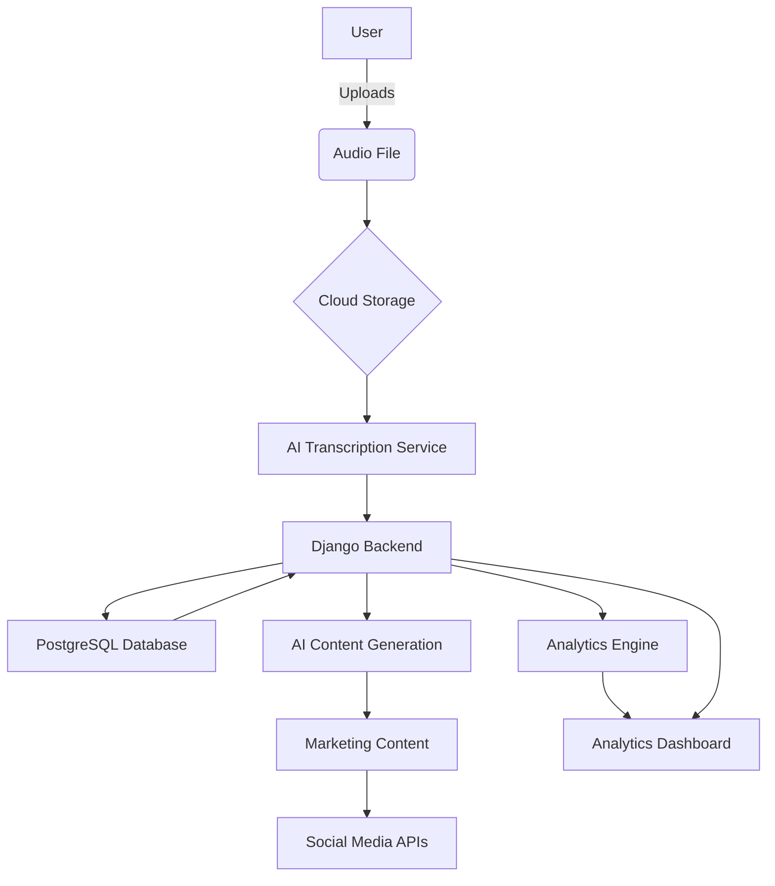

# 1. INTRODUCTION

## 1.1 PURPOSE

The purpose of this Software Requirements Specification (SRS) document is to provide a comprehensive description of the Podcast Marketing Automation SaaS platform. It outlines the functional and non-functional requirements, system architecture, and design constraints for the development team. This document serves as a blueprint for the software development process and a reference for stakeholders, including developers, project managers, quality assurance teams, and potential investors.

## 1.2 SCOPE

The Podcast Marketing Automation SaaS platform is designed to revolutionize the podcast creation and distribution process by leveraging artificial intelligence. The scope of this software product encompasses:

1. Podcast Episode Management:
   - Audio file upload and storage
   - AI-driven metadata generation
   - Episode status management (draft, scheduled, published)

2. AI-Powered Transcription and Metadata Creation:
   - Automated audio transcription
   - AI-generated titles, descriptions, and tags

3. Social Media Marketing Integration:
   - AI-generated marketing content for multiple platforms
   - Automated post scheduling and distribution

4. Analytics Dashboard:
   - Episode performance metrics
   - Social media engagement analytics

5. User Management:
   - Role-based access control (Creator/Host and Collaborator)
   - Secure authentication and authorization

The primary goals of this platform are to:

- Streamline the podcast production workflow
- Enhance podcast discoverability through AI-generated metadata
- Automate and optimize social media marketing efforts
- Provide actionable insights through comprehensive analytics

Key benefits include:

- Time-saving automation of repetitive tasks
- Improved podcast visibility and reach
- Data-driven decision making for content creators
- Seamless integration with major social media platforms

The core functionalities will be built using a modern technology stack, including:

- Frontend: React with TypeScript, TailwindCSS, and ShadCN for UI components
- Backend: Django REST API
- AI Integration: Leveraging models like GPT for various AI-driven features
- Cloud Infrastructure: For scalable audio file storage and processing

This SaaS platform aims to empower podcast creators of all sizes, from individual content creators to large media organizations, by providing an all-in-one solution for podcast management, distribution, and marketing automation.

# 2. PRODUCT DESCRIPTION

## 2.1 PRODUCT PERSPECTIVE

The Podcast Marketing Automation SaaS platform is a standalone system designed to integrate seamlessly with existing podcast hosting platforms and social media networks. It operates within the broader ecosystem of content creation and digital marketing tools, filling a unique niche by automating and optimizing podcast-specific workflows. The product serves as a bridge between audio content creation and multi-channel digital marketing, leveraging AI to enhance productivity and reach for podcast creators.

Key interfaces and integrations include:

1. Audio file storage systems for secure podcast episode management
2. AI-powered transcription and natural language processing services
3. Social media APIs (Facebook, LinkedIn, X, Instagram) for automated content distribution
4. Analytics engines for gathering and presenting performance metrics

The platform is designed as a cloud-based solution, ensuring scalability and accessibility across devices and locations.

## 2.2 PRODUCT FUNCTIONS

The Podcast Marketing Automation SaaS platform offers the following primary functions:

1. Podcast Episode Management
   - Audio file upload and storage
   - AI-driven metadata generation (titles, descriptions, tags)
   - Episode status management (draft, scheduled, published)

2. AI-Powered Transcription and Content Analysis
   - Automated audio-to-text transcription
   - Content summarization and key point extraction
   - Genre and topic classification

3. Automated Marketing Content Generation
   - Platform-specific social media post creation
   - Dynamic content adaptation based on episode themes
   - Hashtag and keyword optimization

4. Social Media Integration and Scheduling
   - Multi-platform content distribution
   - Automated post scheduling
   - Cross-platform campaign management

5. Analytics and Performance Tracking
   - Episode performance metrics (downloads, engagement)
   - Social media campaign analytics
   - Growth trend analysis and reporting

6. User and Role Management
   - Secure authentication and authorization
   - Role-based access control (Creator/Host and Collaborator)

## 2.3 USER CHARACTERISTICS

The platform is designed to cater to a diverse range of podcast creators, from individual content producers to large media organizations. Primary user personas include:

1. Independent Podcast Creator
   - Expertise: Intermediate to advanced in content creation, beginner to intermediate in marketing
   - Needs: Time-saving tools, marketing automation, growth insights

2. Podcast Network Manager
   - Expertise: Advanced in content strategy and team management
   - Needs: Scalable solution for multiple shows, collaborative tools, comprehensive analytics

3. Marketing Team Member
   - Expertise: Advanced in digital marketing, intermediate in podcast production
   - Needs: Efficient content distribution, performance tracking, campaign optimization

4. Content Collaborator
   - Expertise: Varies, typically focused on content creation
   - Needs: Easy-to-use interface, clear task management, limited access to sensitive data

Users are expected to have basic digital literacy and familiarity with podcast creation processes. The interface is designed to be intuitive, accommodating users with varying levels of technical expertise.

## 2.4 CONSTRAINTS

1. Technical Constraints
   - Must be compatible with major web browsers (Chrome, Firefox, Safari, Edge)
   - Audio file size limitations based on cloud storage capabilities
   - API rate limits for social media platforms and third-party services

2. Regulatory Constraints
   - Compliance with GDPR, CCPA, and other relevant data protection regulations
   - Adherence to social media platforms' terms of service and content policies

3. Business Constraints
   - Initial development budget and timeline limitations
   - Pricing structure must align with market expectations and competitor offerings

4. Security Constraints
   - Implementation of industry-standard encryption for data at rest and in transit
   - Regular security audits and penetration testing requirements

5. Usability Constraints
   - Interface must be accessible on both desktop and mobile devices
   - Support for multiple languages in the user interface

## 2.5 ASSUMPTIONS AND DEPENDENCIES

Assumptions:
1. Users have access to a stable internet connection
2. Podcast creators own the rights to the content they upload
3. AI models will continue to improve in accuracy and capability over time
4. The podcast industry will continue to grow, maintaining demand for marketing automation tools

Dependencies:
1. Availability and reliability of cloud infrastructure providers
2. Continued access to social media APIs for content distribution
3. Licensing and availability of AI models for transcription and content generation
4. Stability of the chosen technology stack (React, Django, etc.)
5. Compliance of third-party services with relevant data protection regulations
6. Availability of skilled developers familiar with the chosen technology stack

The success of the platform relies on these assumptions holding true and the consistent availability and performance of the listed dependencies.

Here's the PROCESS FLOWCHART section of the SRS using Mermaid JS, maintaining consistency with the previously mentioned technology and framework choices:

## 2.6 PROCESS FLOWCHART

The following flowchart illustrates the main process flow of the Podcast Marketing Automation SaaS platform:

This flowchart represents the core process of the Podcast Marketing Automation SaaS platform, from user login to the continuous cycle of podcast management, AI-driven content creation, and analytics. The process aligns with the React frontend, Django backend, and AI integration mentioned in previous sections.

Key steps in the process:

1. User Authentication: Secure login process using Django's authentication system.
2. Dashboard: React-based interface displaying key information and navigation options.
3. Podcast Upload: Handling audio file uploads and storage.
4. AI Processing: Leveraging AI models for transcription, metadata generation, and marketing content creation.
5. User Review and Editing: Interface for users to approve or modify AI-generated content.
6. Social Media Integration: Automated scheduling and posting using platform APIs.
7. Analytics: Continuous data collection and dashboard updates for user insights.

This flowchart provides a high-level overview of the system's main processes, demonstrating the integration of AI-driven automation with user interaction points.

Here's a breakdown of the product features with the requested sub-sections, maintaining consistency with the previously mentioned technology and framework choices:

## 3. FUNCTIONAL REQUIREMENTS

### 3.1 Podcast Episode Management

#### ID
PEM-001

#### DESCRIPTION
The Podcast Episode Management feature allows users to upload, store, and manage their podcast episodes. It includes AI-driven metadata generation and episode status management.

#### PRIORITY
High

#### TABLE OF FUNCTIONAL REQUIREMENTS

| ID | Requirement | Description |
|----|-------------|-------------|
| PEM-001.1 | Audio File Upload | Users can upload audio files in MP3 and WAV formats |
| PEM-001.2 | Cloud Storage | Uploaded audio files are securely stored in cloud storage |
| PEM-001.3 | AI Metadata Generation | System generates titles, descriptions, and tags using AI |
| PEM-001.4 | Episode Status Management | Users can save episodes as drafts, schedule, or publish immediately |
| PEM-001.5 | Episode Listing | Display a list of all episodes with their current status |
| PEM-001.6 | Episode Editing | Allow users to edit episode details and metadata |

### 3.2 AI-Powered Transcription and Content Analysis

#### ID
ATC-001

#### DESCRIPTION
This feature provides automated transcription of podcast episodes and AI-driven content analysis for improved metadata and marketing content generation.

#### PRIORITY
High

#### TABLE OF FUNCTIONAL REQUIREMENTS

| ID | Requirement | Description |
|----|-------------|-------------|
| ATC-001.1 | Automated Transcription | Convert audio to text using AI transcription services |
| ATC-001.2 | Transcript Editing | Allow users to view and edit the generated transcript |
| ATC-001.3 | Content Summarization | AI-generated summary of the episode content |
| ATC-001.4 | Key Point Extraction | Identify and extract key points from the transcript |
| ATC-001.5 | Genre Classification | Automatically classify the episode into relevant genres |
| ATC-001.6 | Topic Identification | Identify main topics discussed in the episode |

### 3.3 Automated Marketing Content Generation

#### ID
MCG-001

#### DESCRIPTION
This feature uses AI to generate platform-specific marketing content for social media distribution based on podcast episode content.

#### PRIORITY
High

#### TABLE OF FUNCTIONAL REQUIREMENTS

| ID | Requirement | Description |
|----|-------------|-------------|
| MCG-001.1 | Social Media Post Generation | Create platform-specific posts for LinkedIn, Facebook, X, and Instagram |
| MCG-001.2 | Dynamic Content Adaptation | Adapt content based on episode themes and platform requirements |
| MCG-001.3 | Hashtag Optimization | Generate relevant hashtags for each social media platform |
| MCG-001.4 | Key Quote Extraction | Identify and extract compelling quotes for social media posts |
| MCG-001.5 | Link Generation | Automatically include shortened links to the podcast episode |
| MCG-001.6 | Content Preview | Allow users to preview and edit generated marketing content |

### 3.4 Social Media Integration and Scheduling

#### ID
SMI-001

#### DESCRIPTION
This feature enables automated scheduling and distribution of marketing content across multiple social media platforms.

#### PRIORITY
Medium

#### TABLE OF FUNCTIONAL REQUIREMENTS

| ID | Requirement | Description |
|----|-------------|-------------|
| SMI-001.1 | Multi-Platform Integration | Connect with APIs for LinkedIn, Facebook, X, and Instagram |
| SMI-001.2 | Post Scheduling | Allow users to schedule posts for future dates and times |
| SMI-001.3 | Automated Posting | Execute scheduled posts without user intervention |
| SMI-001.4 | Campaign Management | Group related posts into marketing campaigns |
| SMI-001.5 | Posting Calendar | Visual calendar interface for scheduled posts |
| SMI-001.6 | Error Handling | Notify users of failed posts and provide retry options |

### 3.5 Analytics and Performance Tracking

#### ID
APT-001

#### DESCRIPTION
This feature provides comprehensive analytics on podcast episode performance and social media engagement.

#### PRIORITY
Medium

#### TABLE OF FUNCTIONAL REQUIREMENTS

| ID | Requirement | Description |
|----|-------------|-------------|
| APT-001.1 | Episode Performance Metrics | Track downloads, listens, and engagement for each episode |
| APT-001.2 | Social Media Analytics | Monitor likes, shares, comments, and click-throughs for social posts |
| APT-001.3 | Growth Trend Analysis | Visualize podcast growth trends over time |
| APT-001.4 | Custom Date Ranges | Allow users to select custom date ranges for analytics |
| APT-001.5 | Export Functionality | Enable users to export analytics data in various formats |
| APT-001.6 | Real-time Updates | Provide near real-time updates of performance metrics |

### 3.6 User and Role Management

#### ID
URM-001

#### DESCRIPTION
This feature handles user authentication, authorization, and role-based access control for the platform.

#### PRIORITY
High

#### TABLE OF FUNCTIONAL REQUIREMENTS

| ID | Requirement | Description |
|----|-------------|-------------|
| URM-001.1 | User Registration | Allow new users to create accounts with email verification |
| URM-001.2 | Secure Authentication | Implement secure login with multi-factor authentication option |
| URM-001.3 | Role Assignment | Assign roles (Creator/Host or Collaborator) to users |
| URM-001.4 | Permission Management | Define and manage permissions for each role |
| URM-001.5 | User Profile Management | Allow users to update their profile information |
| URM-001.6 | Password Reset | Provide a secure password reset mechanism |

These functional requirements align with the React frontend, Django backend, and AI integration mentioned in previous sections of the SRS document. They provide a comprehensive breakdown of the key features of the Podcast Marketing Automation SaaS platform.

## 4. NON-FUNCTIONAL REQUIREMENTS

### 4.1 PERFORMANCE

| ID | Requirement | Description |
|----|-------------|-------------|
| PER-001 | Response Time | The system shall respond to user interactions within 2 seconds under normal load conditions |
| PER-002 | Audio Processing | AI transcription of podcast episodes shall complete within 5 minutes for every 60 minutes of audio |
| PER-003 | Content Generation | AI-generated marketing content shall be produced within 30 seconds of request |
| PER-004 | Concurrent Users | The system shall support at least 1000 concurrent users without degradation in performance |
| PER-005 | API Response Time | Third-party API integrations (social media, AI services) shall respond within 5 seconds |
| PER-006 | Database Queries | 95% of database queries shall complete in less than 100ms |

### 4.2 SAFETY

| ID | Requirement | Description |
|----|-------------|-------------|
| SAF-001 | Data Backup | The system shall perform daily backups of all user data and store them in geographically diverse locations |
| SAF-002 | Disaster Recovery | A disaster recovery plan shall be in place with a Recovery Time Objective (RTO) of 4 hours and Recovery Point Objective (RPO) of 1 hour |
| SAF-003 | Failover Mechanism | The system shall implement automatic failover to ensure continuous service in case of server failure |
| SAF-004 | Data Integrity | The system shall maintain ACID (Atomicity, Consistency, Isolation, Durability) properties for all database transactions |
| SAF-005 | Error Handling | The system shall gracefully handle and log all errors without exposing sensitive information to users |

### 4.3 SECURITY

| ID | Requirement | Description |
|----|-------------|-------------|
| SEC-001 | Authentication | The system shall use OAuth 2.0 for user authentication |
| SEC-002 | Authorization | Role-based access control (RBAC) shall be implemented to manage user permissions |
| SEC-003 | Data Encryption | All data at rest shall be encrypted using AES-256 encryption |
| SEC-004 | Data in Transit | All data in transit shall be encrypted using TLS 1.3 |
| SEC-005 | Password Policy | User passwords must be at least 12 characters long and meet complexity requirements |
| SEC-006 | Multi-Factor Authentication | The system shall support multi-factor authentication for user accounts |
| SEC-007 | API Security | API endpoints shall be secured using API keys and rate limiting |
| SEC-008 | Audit Logging | The system shall maintain detailed audit logs of all security-relevant events |

### 4.4 QUALITY

| ID | Requirement | Description |
|----|-------------|-------------|
| QUA-001 | Availability | The system shall maintain 99.9% uptime, measured on a monthly basis |
| QUA-002 | Maintainability | The codebase shall adhere to PEP 8 style guide for Python code and Airbnb style guide for JavaScript/TypeScript |
| QUA-003 | Usability | The user interface shall achieve a System Usability Scale (SUS) score of at least 80 |
| QUA-004 | Scalability | The system shall be able to scale horizontally to handle a 200% increase in user load without performance degradation |
| QUA-005 | Reliability | The Mean Time Between Failures (MTBF) shall be at least 720 hours |
| QUA-006 | Testability | The system shall maintain a test coverage of at least 80% for both frontend and backend code |

### 4.5 COMPLIANCE

| ID | Requirement | Description |
|----|-------------|-------------|
| COM-001 | GDPR Compliance | The system shall comply with all requirements of the General Data Protection Regulation (GDPR) |
| COM-002 | CCPA Compliance | The system shall comply with the California Consumer Privacy Act (CCPA) |
| COM-003 | WCAG Compliance | The user interface shall conform to Web Content Accessibility Guidelines (WCAG) 2.1 Level AA |
| COM-004 | PCI DSS Compliance | If implementing payment processing, the system shall comply with Payment Card Industry Data Security Standard (PCI DSS) |
| COM-005 | API Compliance | The system shall adhere to RESTful API design principles and OpenAPI Specification |
| COM-006 | Social Media Compliance | All automated social media interactions shall comply with the respective platform's terms of service and API usage guidelines |

These non-functional requirements align with the React frontend, Django backend, and AI integration mentioned in previous sections of the SRS document. They provide a comprehensive set of performance, safety, security, quality, and compliance requirements for the Podcast Marketing Automation SaaS platform.

## 5. DATA REQUIREMENTS

### 5.1 DATA MODELS

The following entity-relationship diagram illustrates the core data models for the Podcast Marketing Automation SaaS platform:

This diagram represents the core entities and their relationships in the system, aligning with the Django backend and the requirements outlined in previous sections.

### 5.2 DATA STORAGE

#### 5.2.1 Database Management System

The Podcast Marketing Automation SaaS platform will use PostgreSQL as the primary relational database management system, which aligns well with the Django backend.

#### 5.2.2 Audio File Storage

Audio files will be stored in a cloud object storage service (e.g., Amazon S3 or Google Cloud Storage) to ensure scalability and efficient access.

#### 5.2.3 Data Retention

- User account data: Retained for the lifetime of the account, plus 30 days after account deletion.
- Podcast and episode metadata: Retained indefinitely or until explicitly deleted by the user.
- Audio files: Retained as long as the associated episode exists in the system.
- Transcripts: Retained as long as the associated episode exists in the system.
- Marketing content and social media posts: Retained for 1 year after creation for analytics purposes.
- Analytics data: Aggregated daily and retained for 2 years.

#### 5.2.4 Data Redundancy and Backup

1. Database Redundancy:
   - Implement PostgreSQL replication with at least one standby server.
   - Use multi-zone deployment to ensure geographical redundancy.

2. Regular Backups:
   - Full database backups: Daily
   - Incremental backups: Every 6 hours
   - Transaction log backups: Every 15 minutes

3. Audio File Redundancy:
   - Store audio files with redundancy built into the chosen cloud storage service (e.g., Amazon S3 with cross-region replication).

4. Backup Retention:
   - Daily backups: Retained for 30 days
   - Weekly backups: Retained for 3 months
   - Monthly backups: Retained for 1 year

#### 5.2.5 Recovery

1. Database Recovery:
   - Implement point-in-time recovery using transaction logs.
   - Automate the recovery process to minimize downtime.
   - Target Recovery Time Objective (RTO): 1 hour
   - Target Recovery Point Objective (RPO): 15 minutes

2. Audio File Recovery:
   - Leverage cloud storage versioning and cross-region replication for quick recovery of audio files.

3. Regular Recovery Testing:
   - Conduct monthly recovery drills to ensure the effectiveness of the backup and recovery processes.

### 5.3 DATA PROCESSING

#### 5.3.1 Data Security

1. Encryption:
   - Implement AES-256 encryption for data at rest in the database.
   - Use TLS 1.3 for all data in transit.

2. Access Control:
   - Implement role-based access control (RBAC) for data access.
   - Use Django's ORM to enforce row-level security where applicable.

3. Auditing:
   - Implement comprehensive audit logging for all data modifications.

4. Data Anonymization:
   - Use data anonymization techniques for non-production environments.

#### 5.3.2 Data Flow

The following diagram illustrates the high-level data flow within the Podcast Marketing Automation SaaS platform:

This data flow diagram shows the journey of data from user upload through various processing stages, including AI services, database storage, and eventual presentation in the analytics dashboard. It aligns with the React frontend, Django backend, and AI integration mentioned in previous sections of the SRS document.

## 6. EXTERNAL INTERFACES

### 6.1 USER INTERFACES

The Podcast Marketing Automation SaaS platform will feature a responsive web-based user interface built using React with TypeScript, TailwindCSS, and ShadCN for UI components. The interface will be designed to be intuitive, accessible, and consistent across different devices and screen sizes.

Key UI components include:

1. Landing Page:
   - Clean, modern design with clear call-to-action for sign-up/login
   - Brief overview of key features and benefits

2. Dashboard:
   - Overview of recent activities, upcoming scheduled posts, and key metrics
   - Quick access to main features (upload episode, view analytics, etc.)

3. Episode Management Interface:
   - List view of all episodes with status indicators
   - Detailed view for individual episodes with editing capabilities

4. Marketing Content Generation:
   - AI-generated content preview with editing options
   - Platform-specific views for different social media channels

5. Analytics Dashboard:
   - Visual representations of key performance indicators
   - Customizable date range selectors and filtering options

6. Settings and Profile Management:
   - User profile editing
   - Account settings and preferences

UI Mockup Placeholders:
[Placeholder for Landing Page Mockup]
[Placeholder for Dashboard Mockup]
[Placeholder for Episode Management Interface Mockup]
[Placeholder for Marketing Content Generation Interface Mockup]
[Placeholder for Analytics Dashboard Mockup]

The user interface will support both light and dark modes, automatically switching based on user OS/browser settings to enhance usability and reduce eye strain.

### 6.2 SOFTWARE INTERFACES

The Podcast Marketing Automation SaaS platform will interact with various external software systems and APIs to provide its full range of functionalities:

1. Cloud Storage Service (e.g., Amazon S3 or Google Cloud Storage):
   - Purpose: Store and retrieve audio files and other media assets
   - Interface: RESTful API
   - Data Format: JSON for metadata, binary for audio files

2. AI Transcription Service:
   - Purpose: Convert audio to text
   - Interface: RESTful API
   - Data Format: JSON for requests and responses

3. Natural Language Processing (NLP) API (e.g., GPT-based service):
   - Purpose: Generate titles, descriptions, and marketing content
   - Interface: RESTful API
   - Data Format: JSON

4. Social Media APIs:
   a. Facebook Graph API:
      - Purpose: Post content and retrieve analytics
      - Interface: RESTful API
      - Data Format: JSON
   b. LinkedIn API:
      - Purpose: Share content and gather engagement metrics
      - Interface: RESTful API
      - Data Format: JSON
   c. X (Twitter) API:
      - Purpose: Post tweets and retrieve analytics
      - Interface: RESTful API
      - Data Format: JSON
   d. Instagram Graph API:
      - Purpose: Share content and gather engagement metrics
      - Interface: RESTful API
      - Data Format: JSON

5. Analytics Service (e.g., Google Analytics):
   - Purpose: Collect and process user behavior data
   - Interface: JavaScript library and RESTful API
   - Data Format: JSON

6. Payment Gateway (e.g., Stripe):
   - Purpose: Process subscription payments
   - Interface: RESTful API and client-side JavaScript library
   - Data Format: JSON

7. Email Service Provider (e.g., SendGrid):
   - Purpose: Send transactional emails and notifications
   - Interface: RESTful API
   - Data Format: JSON

All software interfaces will use secure communication protocols (HTTPS) and implement proper authentication and authorization mechanisms as required by each service.

### 6.3 COMMUNICATION INTERFACES

The Podcast Marketing Automation SaaS platform will utilize the following communication interfaces:

1. HTTP/HTTPS:
   - Purpose: Primary protocol for client-server communication
   - Specification: HTTP/1.1 and HTTP/2
   - Port: 80 (HTTP), 443 (HTTPS)
   - Security: TLS 1.3 for all HTTPS communications

2. WebSocket:
   - Purpose: Real-time updates for analytics and notifications
   - Specification: WebSocket protocol (RFC 6455)
   - Port: 443 (WSS)
   - Security: TLS 1.3 for secure WebSocket connections

3. SMTP:
   - Purpose: Sending emails for user notifications and account management
   - Specification: SMTP (RFC 5321)
   - Port: 587 (STARTTLS)
   - Security: STARTTLS for encrypted email transmission

4. OAuth 2.0:
   - Purpose: Authentication and authorization for social media integrations
   - Specification: OAuth 2.0 (RFC 6749)
   - Security: Implements state parameter and PKCE (Proof Key for Code Exchange) for additional security

5. REST API:
   - Purpose: Communication between frontend and backend, and with external services
   - Specification: RESTful principles
   - Data Format: JSON
   - Authentication: JWT (JSON Web Tokens) for API authentication

6. GraphQL:
   - Purpose: Efficient data querying for complex analytics requests
   - Specification: GraphQL specification
   - Transport: HTTP POST requests
   - Security: Implement query complexity limits and timeout policies

7. WebRTC:
   - Purpose: Potential future feature for real-time collaboration between users
   - Specification: WebRTC standards
   - Security: Implement DTLS (Datagram Transport Layer Security) for peer-to-peer encryption

All communication interfaces will adhere to industry-standard security practices, including:
- Regular security audits and penetration testing
- Implementation of rate limiting and request throttling to prevent abuse
- Use of secure headers (e.g., HSTS, CSP) for HTTP communications
- Proper error handling to prevent information leakage

These communication interfaces align with the React frontend, Django backend, and cloud-based infrastructure mentioned in previous sections of the SRS document, ensuring seamless integration and secure data exchange throughout the Podcast Marketing Automation SaaS platform.

## APPENDICES

### GLOSSARY

| Term | Definition |
|------|------------|
| Podcast | A digital audio file made available on the internet for downloading to a computer or mobile device, typically available as a series, new installments of which can be received by subscribers automatically |
| SaaS | Software as a Service; a software licensing and delivery model in which software is licensed on a subscription basis and is centrally hosted |
| AI | Artificial Intelligence; the simulation of human intelligence processes by machines, especially computer systems |
| Transcription | The process of converting speech or audio content into written or electronic text |
| Metadata | Data that provides information about other data, in this context, information about podcast episodes such as title, description, and tags |
| API | Application Programming Interface; a set of protocols and tools for building software applications |
| OAuth | Open Authorization; an open standard for access delegation, commonly used as a way for internet users to grant websites or applications access to their information on other websites but without giving them the passwords |

### ACRONYMS

| Acronym | Expanded Form |
|---------|---------------|
| SRS | Software Requirements Specification |
| UI | User Interface |
| REST | Representational State Transfer |
| JSON | JavaScript Object Notation |
| GDPR | General Data Protection Regulation |
| CCPA | California Consumer Privacy Act |
| WCAG | Web Content Accessibility Guidelines |
| PCI DSS | Payment Card Industry Data Security Standard |
| RBAC | Role-Based Access Control |
| TLS | Transport Layer Security |
| AES | Advanced Encryption Standard |
| JWT | JSON Web Token |
| SMTP | Simple Mail Transfer Protocol |
| HSTS | HTTP Strict Transport Security |
| CSP | Content Security Policy |
| ACID | Atomicity, Consistency, Isolation, Durability |
| RTO | Recovery Time Objective |
| RPO | Recovery Point Objective |

### ADDITIONAL REFERENCES

1. React Documentation
   - https://reactjs.org/docs/getting-started.html

2. Django Documentation
   - https://docs.djangoproject.com/en/stable/

3. TypeScript Handbook
   - https://www.typescriptlang.org/docs/

4. TailwindCSS Documentation
   - https://tailwindcss.com/docs

5. PostgreSQL Documentation
   - https://www.postgresql.org/docs/

6. OAuth 2.0 Specification
   - https://oauth.net/2/

7. Web Content Accessibility Guidelines (WCAG) 2.1
   - https://www.w3.org/TR/WCAG21/

8. General Data Protection Regulation (GDPR)
   - https://gdpr.eu/

9. California Consumer Privacy Act (CCPA)
   - https://oag.ca.gov/privacy/ccpa

10. RESTful API Design Best Practices
    - https://restfulapi.net/

11. GraphQL Specification
    - https://spec.graphql.org/

12. WebSocket Protocol Specification
    - https://tools.ietf.org/html/rfc6455

13. JSON Web Token (JWT) Introduction
    - https://jwt.io/introduction/

14. Cloud Storage Security Best Practices
    - https://cloud.google.com/security/best-practices

15. Artificial Intelligence in Content Creation
    - https://www.frontiersin.org/articles/10.3389/frai.2021.680565/full

These additional references provide in-depth information on the technologies, frameworks, and standards mentioned throughout the SRS document. They serve as valuable resources for the development team and other stakeholders involved in the Podcast Marketing Automation SaaS platform project.