# 1. INTRODUCTION

## 1.1 SYSTEM OVERVIEW

The Podcast Marketing Automation SaaS platform is a comprehensive, AI-driven solution designed to streamline the entire podcast production and marketing workflow. This system integrates cutting-edge artificial intelligence technologies with robust cloud infrastructure to provide podcast creators with an all-in-one tool for managing, distributing, and promoting their content.

Key components of the system include:

1. User Interface: A responsive web application built with React and TypeScript, offering an intuitive dashboard for podcast management and analytics.

2. Backend Services: Powered by Django, providing RESTful APIs for data management, user authentication, and business logic implementation.

3. AI Services: Leveraging state-of-the-art natural language processing models for transcription, content analysis, and marketing content generation.

4. Data Storage: Utilizing PostgreSQL for structured data and cloud object storage for audio files and media assets.

5. Social Media Integration: Automated content distribution across major platforms like LinkedIn, Facebook, X (Twitter), and Instagram.

6. Analytics Engine: Real-time data processing and visualization of podcast performance and marketing campaign effectiveness.

The system architecture can be visualized as follows:

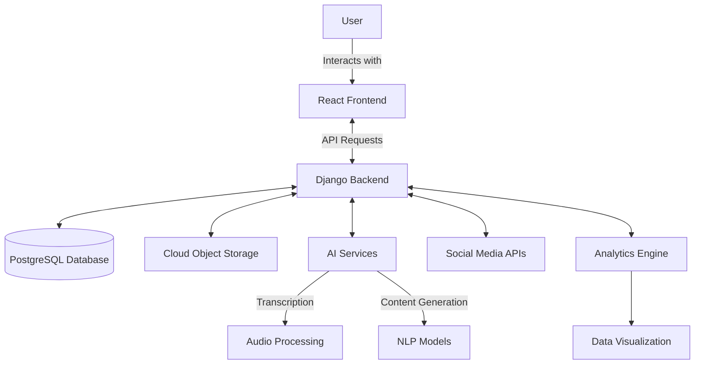

This architecture ensures scalability, maintainability, and efficient data flow throughout the system, aligning with modern software development practices and the specific requirements of podcast creators.

## 1.2 SCOPE

The Podcast Marketing Automation SaaS platform aims to revolutionize the podcast industry by providing a comprehensive suite of tools that automate and optimize the entire podcast production and marketing lifecycle. The scope of this software product encompasses:

### Goals:
1. Streamline podcast episode management and distribution
2. Automate time-consuming tasks such as transcription and metadata generation
3. Leverage AI to create engaging marketing content across multiple social media platforms
4. Provide actionable insights through comprehensive analytics

### Benefits:
1. Time-saving: Automate repetitive tasks, allowing creators to focus on content production
2. Increased Reach: Optimize social media presence and improve podcast discoverability
3. Data-Driven Decision Making: Provide creators with detailed analytics to inform content strategy
4. Cost-Effective: Offer an all-in-one solution, reducing the need for multiple separate tools

### Core Functionalities:

| Functionality | Description |
|---------------|-------------|
| Podcast Episode Management | Upload, store, and manage podcast episodes with AI-driven metadata generation |
| AI-Powered Transcription | Automatically transcribe audio content with high accuracy |
| Content Analysis | Extract key topics, sentiment, and themes from podcast episodes |
| Marketing Content Generation | Create platform-specific social media posts using AI |
| Social Media Integration | Schedule and automate post distribution across multiple platforms |
| Analytics Dashboard | Track podcast performance and marketing campaign effectiveness |
| User Management | Secure authentication and role-based access control |

The Podcast Marketing Automation SaaS platform is designed to cater to a wide range of users, from individual podcast creators to large media organizations. By providing a scalable, AI-driven solution, the platform aims to democratize advanced marketing tools and empower creators to grow their audience efficiently and effectively.

This scope aligns with the previously mentioned technology stack, including React for the frontend, Django for the backend, and various AI services for content processing and generation. The platform's comprehensive approach to podcast management and marketing automation positions it as a unique and valuable tool in the rapidly growing podcast industry.

## 2. SYSTEM ARCHITECTURE

### 2.1 PROGRAMMING LANGUAGES

The Podcast Marketing Automation SaaS platform will utilize the following programming languages:

| Language | Purpose | Justification |
|----------|---------|---------------|
| Python 3.9+ | Backend development (Django) | - Excellent for rapid development<br>- Strong ecosystem for AI and data processing<br>- Django's robust ORM and admin interface |
| TypeScript 4.5+ | Frontend development (React) | - Static typing for improved code quality and maintainability<br>- Enhanced developer productivity with better tooling and IDE support |
| JavaScript (ES6+) | Frontend development (React) | - Necessary for browser compatibility<br>- Used alongside TypeScript for certain libraries |
| SQL | Database queries | - Efficient data retrieval and manipulation in PostgreSQL |
| HTML5 | Frontend markup | - Standard for web content structure |
| CSS3 | Frontend styling | - Used with TailwindCSS for responsive and maintainable styles |

### 2.2 HIGH-LEVEL ARCHITECTURE DIAGRAM

The following diagram provides an overview of the system's components and their interactions:

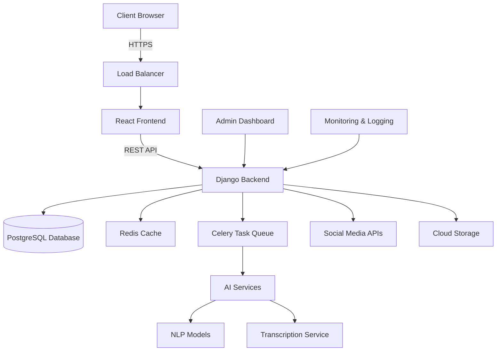

### 2.3 COMPONENT DIAGRAMS

The following diagram details the specific components within the system:

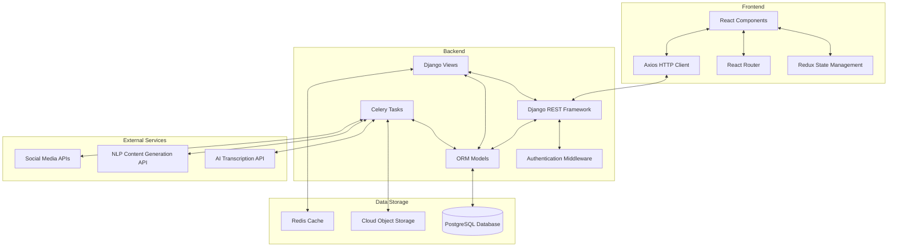

### 2.4 SEQUENCE DIAGRAMS

The following sequence diagram illustrates the process of uploading a podcast episode and generating marketing content:

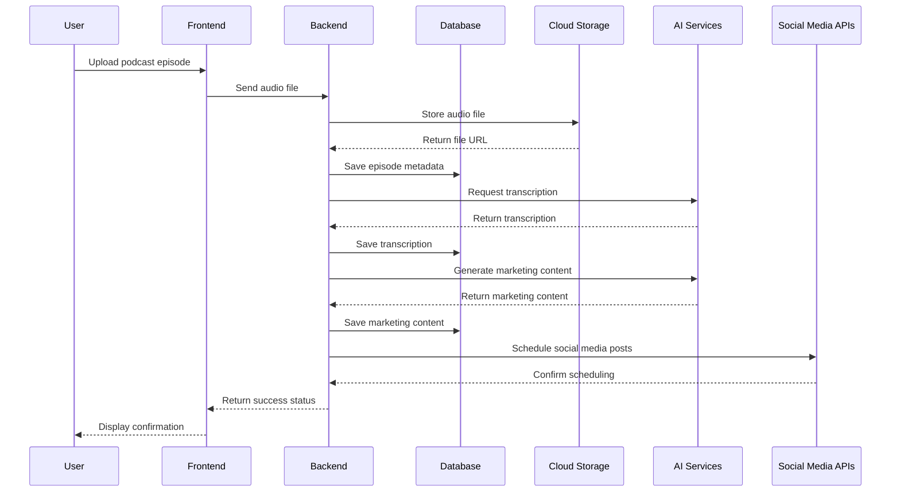

### 2.5 DATA-FLOW DIAGRAM

The following diagram explains how information moves through the system:

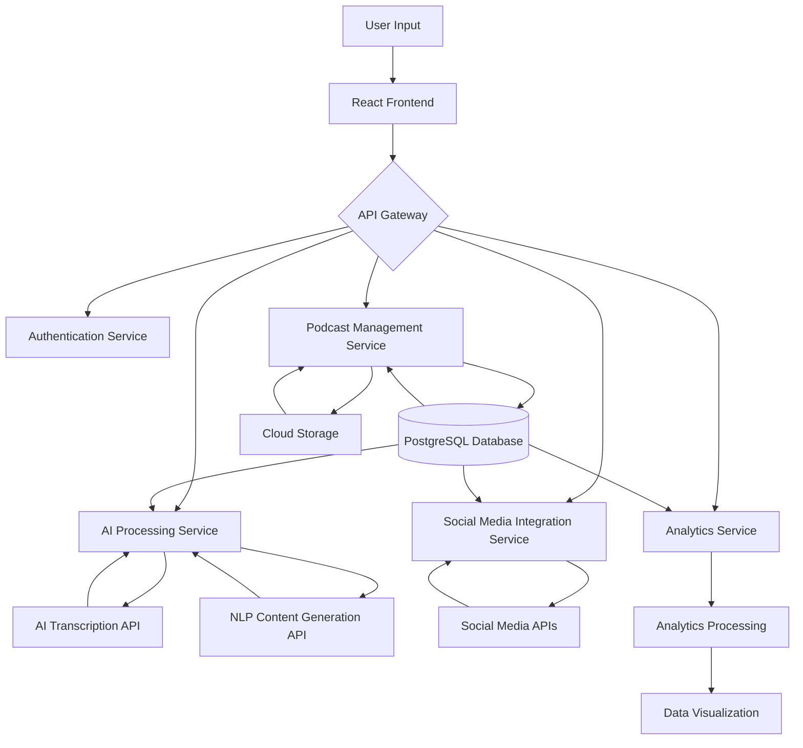

This data-flow diagram illustrates the movement of information through various components of the Podcast Marketing Automation SaaS platform. User input is processed through the React frontend, which communicates with different backend services via the API gateway. These services interact with the database, cloud storage, and external APIs to process, store, and retrieve data. The analytics service collects data from various sources, processes it, and prepares it for visualization, providing insights to the user through the frontend.

This architecture ensures a scalable, maintainable, and efficient system that aligns with the previously mentioned technology stack and requirements.

## 3. SYSTEM DESIGN

### 3.1 PROGRAMMING LANGUAGES

The Podcast Marketing Automation SaaS platform will utilize the following programming languages:

| Language | Purpose | Justification |
|----------|---------|---------------|
| Python 3.9+ | Backend development (Django) | - Excellent for rapid development<br>- Strong ecosystem for AI and data processing<br>- Django's robust ORM and admin interface |
| TypeScript 4.5+ | Frontend development (React) | - Static typing for improved code quality and maintainability<br>- Enhanced developer productivity with better tooling and IDE support |
| JavaScript (ES6+) | Frontend development (React) | - Necessary for browser compatibility<br>- Used alongside TypeScript for certain libraries |
| SQL | Database queries | - Efficient data retrieval and manipulation in PostgreSQL |
| HTML5 | Frontend markup | - Standard for web content structure |
| CSS3 | Frontend styling | - Used with TailwindCSS for responsive and maintainable styles |

### 3.2 DATABASE DESIGN

The Podcast Marketing Automation SaaS platform will use PostgreSQL as the primary relational database. The database schema is designed to support the core functionalities of the system:

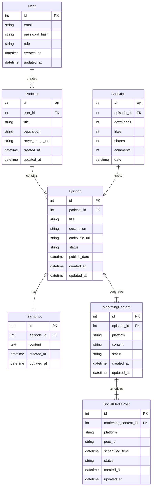

This schema supports the core entities and relationships required for the platform's functionality, including user management, podcast and episode tracking, transcription storage, marketing content generation, social media posting, and analytics.

### 3.3 API DESIGN

The Podcast Marketing Automation SaaS platform will use a RESTful API design for communication between the frontend and backend, as well as for integrating with external services. The API will be built using Django REST Framework.

Key API endpoints:

| Endpoint | Method | Description |
|----------|--------|-------------|
| `/api/auth/login` | POST | User authentication |
| `/api/auth/register` | POST | User registration |
| `/api/podcasts` | GET, POST | List and create podcasts |
| `/api/podcasts/{id}` | GET, PUT, DELETE | Retrieve, update, or delete a specific podcast |
| `/api/episodes` | GET, POST | List and create episodes |
| `/api/episodes/{id}` | GET, PUT, DELETE | Retrieve, update, or delete a specific episode |
| `/api/episodes/{id}/transcript` | GET, POST | Retrieve or create transcript for an episode |
| `/api/episodes/{id}/marketing-content` | GET, POST | Generate or retrieve marketing content for an episode |
| `/api/social-media/schedule` | POST | Schedule social media posts |
| `/api/analytics/episode/{id}` | GET | Retrieve analytics for a specific episode |

API Authentication:
- JWT (JSON Web Tokens) will be used for API authentication
- Tokens will be included in the Authorization header of API requests

API Versioning:
- API versioning will be implemented using URL prefixing (e.g., `/api/v1/`)

### 3.4 USER INTERFACE DESIGN

The user interface will be designed using React with TypeScript, TailwindCSS, and ShadCN UI components. Here are markdown wireframe mockups for key interfaces:

#### Dashboard

```
+----------------------------------+
|  Logo   [User Profile] [Settings]|
+----------------------------------+
| [Upload] [Analytics] [Marketing] |
+----------------------------------+
| Recent Episodes                  |
| +------------------------------+ |
| | Episode 1                    | |
| | [Edit] [Generate Marketing]  | |
| +------------------------------+ |
| | Episode 2                    | |
| | [Edit] [Generate Marketing]  | |
| +------------------------------+ |
+----------------------------------+
| Upcoming Scheduled Posts         |
| +------------------------------+ |
| | Platform | Date     | Status | |
| | Twitter  | 2023-5-1 | Pending| |
| | LinkedIn | 2023-5-2 | Pending| |
| +------------------------------+ |
+----------------------------------+
```

#### Episode Upload and Management

```
+----------------------------------+
| [Back to Dashboard]              |
+----------------------------------+
| Upload New Episode               |
| +------------------------------+ |
| | Title: [                   ] | |
| | Description: [             ] | |
| | Audio File: [Choose File   ] | |
| | [Upload]                     | |
| +------------------------------+ |
+----------------------------------+
| Episode List                     |
| +------------------------------+ |
| | Title | Date | Status | Action| |
| | Ep 1  | 5/1  | Live   | [Edit]| |
| | Ep 2  | 5/8  | Draft  | [Edit]| |
| +------------------------------+ |
+----------------------------------+
```

#### Marketing Content Generation

```
+----------------------------------+
| [Back to Episode]                |
+----------------------------------+
| Generate Marketing Content       |
| +------------------------------+ |
| | Platform: [Twitter  v]       | |
| | [Generate]                   | |
| +------------------------------+ |
| Generated Content               |
| +------------------------------+ |
| | Tweet 1: [Edit] [Schedule]   | |
| | Tweet 2: [Edit] [Schedule]   | |
| | Tweet 3: [Edit] [Schedule]   | |
| +------------------------------+ |
+----------------------------------+
```

### 3.5 THEME DESIGN

The user interface will follow a modern, clean design with a focus on readability and ease of use. The color scheme will be based on a professional and tech-forward palette:

Primary Colors:
- Deep Blue: #1E40AF (Primary brand color)
- Light Gray: #F3F4F6 (Background color)
- White: #FFFFFF (Content background)

Accent Colors:
- Teal: #0D9488 (Success actions, positive trends)
- Coral: #F43F5E (Warnings, alerts)
- Purple: #7C3AED (Highlights, calls-to-action)

Typography:
- Primary Font: Inter (Sans-serif)
- Heading Sizes: 
  - H1: 2.5rem (40px)
  - H2: 2rem (32px)
  - H3: 1.5rem (24px)
- Body Text: 1rem (16px)

Icons:
- Use Heroicons set for consistent, modern iconography

Responsive Design:
- Implement a mobile-first approach using TailwindCSS breakpoints
- Ensure all interfaces are fully functional on devices ranging from smartphones to large desktop monitors

Accessibility:
- Maintain WCAG 2.1 AA compliance for color contrast and interactive elements
- Implement proper ARIA labels and keyboard navigation support

This theme design ensures a professional, modern look that aligns with the innovative nature of the Podcast Marketing Automation SaaS platform while maintaining high usability and accessibility standards.

## TECHNOLOGY STACK

### PROGRAMMING LANGUAGES

The following programming languages will be used in the development of the Podcast Marketing Automation SaaS platform:

| Language | Purpose | Justification |
|----------|---------|---------------|
| Python 3.9+ | Backend development | - Django framework compatibility<br>- Extensive libraries for AI and data processing<br>- Clear syntax for maintainability |
| TypeScript 4.5+ | Frontend development | - Static typing for improved code quality<br>- Enhanced developer productivity<br>- Better tooling and IDE support |
| JavaScript (ES6+) | Frontend development | - Necessary for browser compatibility<br>- Used alongside TypeScript for certain libraries |
| SQL | Database queries | - Efficient data retrieval and manipulation in PostgreSQL |
| HTML5 | Frontend markup | - Standard for web content structure |
| CSS3 | Frontend styling | - Used with TailwindCSS for responsive design |

### FRAMEWORKS AND LIBRARIES

The following frameworks and libraries will be utilized in the project:

| Framework/Library | Purpose | Version |
|-------------------|---------|---------|
| Django | Backend web framework | 4.2+ |
| Django REST Framework | API development | 3.14+ |
| React | Frontend UI library | 18.0+ |
| Redux | State management | 4.2+ |
| TailwindCSS | Utility-first CSS framework | 3.0+ |
| ShadCN UI | React component library | Latest stable |
| Celery | Distributed task queue | 5.2+ |
| pytest | Backend testing | 7.0+ |
| Jest | Frontend testing | 29.0+ |
| React Testing Library | Frontend component testing | 13.0+ |
| Axios | HTTP client | 1.3+ |
| Socket.IO | Real-time communication | 4.5+ |

### DATABASES

The following database systems will be employed:

| Database | Purpose | Version |
|----------|---------|---------|
| PostgreSQL | Primary relational database | 14+ |
| Redis | Caching and session storage | 6.2+ |

### THIRD-PARTY SERVICES

The following external services and APIs will be integrated into the system:

| Service | Purpose | API Version |
|---------|---------|-------------|
| Amazon S3 | Cloud storage for audio files | Latest |
| Google Cloud Speech-to-Text | AI transcription | v1p1beta1 |
| OpenAI GPT-3 | Natural language processing for content generation | Latest |
| Facebook Graph API | Social media integration | v15.0+ |
| LinkedIn API | Social media integration | v2 |
| Twitter API | Social media integration | v2 |
| Instagram Graph API | Social media integration | v12.0+ |
| Stripe | Payment processing | 2022-11-15 |
| SendGrid | Email service | v3 |
| Google Analytics | Web analytics | GA4 |

### TECHNOLOGY STACK DIAGRAM

The following diagram illustrates the overall technology stack of the Podcast Marketing Automation SaaS platform:

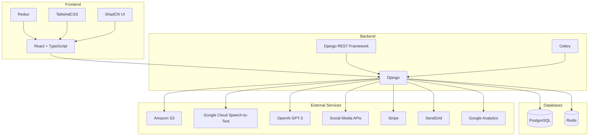

This technology stack ensures a robust, scalable, and maintainable architecture for the Podcast Marketing Automation SaaS platform. It leverages modern frameworks and services to provide a high-performance, AI-driven solution for podcast creators.

## SECURITY CONSIDERATIONS

### AUTHENTICATION AND AUTHORIZATION

The Podcast Marketing Automation SaaS platform will implement a robust authentication and authorization system to ensure secure access and protect user data.

#### Authentication

1. User Authentication:
   - Implement OAuth 2.0 for user authentication
   - Support multi-factor authentication (MFA) using Time-based One-Time Passwords (TOTP)
   - Enforce strong password policies (minimum 12 characters, complexity requirements)

2. API Authentication:
   - Use JSON Web Tokens (JWT) for API authentication
   - Implement token expiration and refresh mechanisms

#### Authorization

1. Role-Based Access Control (RBAC):
   - Implement fine-grained RBAC using Django's built-in permissions system
   - Define the following roles:
     - Admin: Full system access
     - Creator/Host: Full access to own podcasts and analytics
     - Collaborator: Limited access to assigned podcasts
     - Viewer: Read-only access to specific podcasts

2. API Authorization:
   - Use OAuth 2.0 scopes to control API access
   - Implement rate limiting and request throttling to prevent abuse

#### Authentication Flow

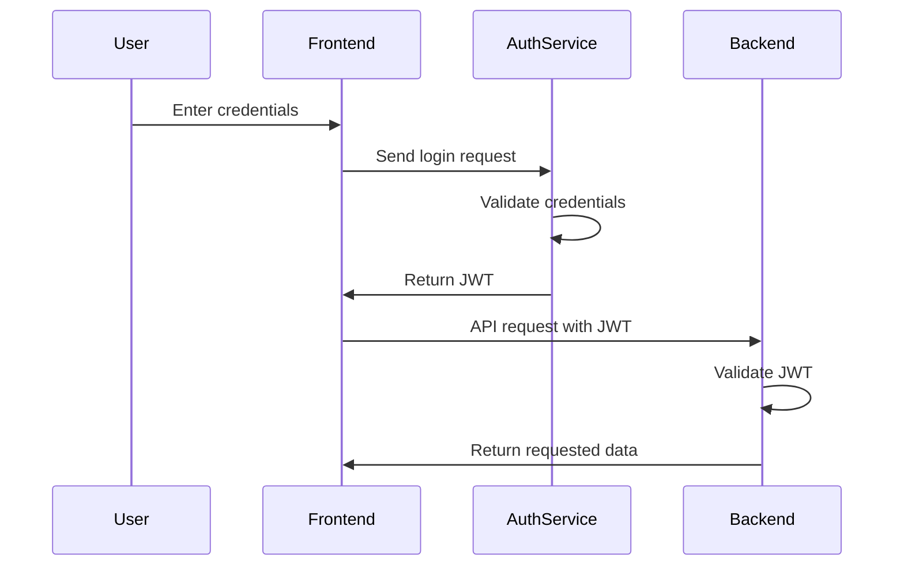

### DATA SECURITY

To protect sensitive information and maintain user privacy, the following data security measures will be implemented:

1. Encryption:
   - Use AES-256 encryption for data at rest in the PostgreSQL database
   - Implement TLS 1.3 for all data in transit
   - Encrypt sensitive data fields (e.g., API keys) using Django's built-in encryption tools

2. Data Anonymization:
   - Implement data anonymization techniques for non-production environments
   - Use data masking for sensitive information in logs and error reports

3. Secure File Storage:
   - Store audio files and media assets in cloud storage with server-side encryption
   - Implement signed URLs with expiration for secure file access

4. Database Security:
   - Use parameterized queries to prevent SQL injection attacks
   - Implement row-level security in PostgreSQL for multi-tenant data isolation

5. Key Management:
   - Use a secure key management service (e.g., AWS KMS or HashiCorp Vault) for storing and managing encryption keys and secrets

6. Data Retention and Deletion:
   - Implement automated data retention policies in compliance with GDPR and CCPA
   - Provide users with the ability to request data deletion (right to be forgotten)

### SECURITY PROTOCOLS

The following security protocols and standards will be implemented to maintain system security:

1. Network Security:
   - Use Web Application Firewall (WAF) to protect against common web exploits
   - Implement DDoS protection at the infrastructure level
   - Use Virtual Private Cloud (VPC) to isolate backend services

2. Application Security:
   - Conduct regular security audits and penetration testing
   - Implement Content Security Policy (CSP) headers
   - Use HTTP Strict Transport Security (HSTS) to enforce HTTPS
   - Implement proper error handling to prevent information leakage

3. Dependency Management:
   - Regularly update and patch all dependencies
   - Use automated tools to scan for vulnerabilities in dependencies

4. Secure Development Practices:
   - Follow OWASP Top 10 guidelines for secure web application development
   - Implement secure code review processes
   - Use static code analysis tools to identify potential security issues

5. Monitoring and Incident Response:
   - Implement comprehensive logging and monitoring solutions
   - Set up alerts for suspicious activities or potential security breaches
   - Develop and maintain an incident response plan

6. Compliance:
   - Ensure compliance with GDPR, CCPA, and other relevant data protection regulations
   - Implement privacy by design principles throughout the system

7. Third-Party Integrations:
   - Conduct security assessments of all third-party services and APIs
   - Use OAuth 2.0 for secure authorization with third-party services

#### Security Measures Summary

| Category | Measure | Implementation |
|----------|---------|-----------------|
| Authentication | Multi-Factor Authentication | TOTP using Google Authenticator or similar |
| Authorization | Role-Based Access Control | Django's permission system |
| Data Encryption | At Rest | AES-256 in PostgreSQL |
| Data Encryption | In Transit | TLS 1.3 |
| API Security | Authentication | JWT with expiration |
| API Security | Rate Limiting | Django REST framework throttling |
| File Security | Cloud Storage | Server-side encryption, signed URLs |
| Network Security | Web Application Firewall | Cloud provider's WAF service |
| Application Security | Content Security Policy | CSP headers in Django |
| Monitoring | Security Information and Event Management (SIEM) | ELK Stack or cloud-native solution |

These security considerations align with the React frontend, Django backend, and cloud-based infrastructure mentioned in previous sections of the Technical Specifications document. They provide a comprehensive approach to securing the Podcast Marketing Automation SaaS platform, protecting user data, and ensuring compliance with relevant regulations.

## INFRASTRUCTURE

### DEPLOYMENT ENVIRONMENT

The Podcast Marketing Automation SaaS platform will be deployed in a cloud-based environment to ensure scalability, reliability, and global accessibility. This choice aligns with the SaaS model and the need for flexible resource allocation.

| Environment Type | Description | Justification |
|------------------|-------------|---------------|
| Cloud-based | Fully cloud-hosted infrastructure | - Scalability to handle varying loads<br>- High availability and fault tolerance<br>- Reduced maintenance overhead<br>- Global content delivery capabilities |

### CLOUD SERVICES

We will utilize Amazon Web Services (AWS) as our primary cloud service provider due to its comprehensive service offerings, global presence, and robust ecosystem that aligns well with our technology stack.

| AWS Service | Purpose | Justification |
|-------------|---------|---------------|
| Amazon EC2 | Hosting Django backend | Scalable compute capacity |
| Amazon RDS for PostgreSQL | Database hosting | Managed database service with high availability |
| Amazon S3 | Audio file and media storage | Scalable object storage with CDN integration |
| Amazon CloudFront | Content Delivery Network | Global content delivery for improved performance |
| Amazon ElastiCache | Caching layer | Improved performance for frequently accessed data |
| Amazon SQS | Message queuing | Reliable communication between microservices |
| AWS Lambda | Serverless computing | Event-driven AI processing tasks |
| Amazon ECS | Container orchestration | Efficient management of Docker containers |
| AWS Cognito | User authentication | Scalable user management and authentication |

### CONTAINERIZATION

The application will use Docker for containerization to ensure consistency across development, testing, and production environments.

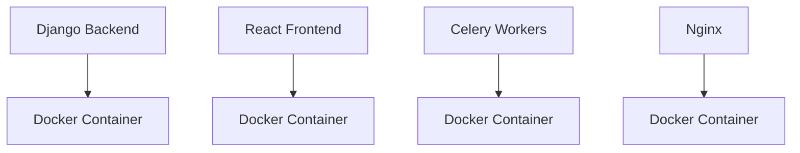

Key benefits of using Docker:
1. Consistent environments across development, testing, and production
2. Easier scaling and deployment of microservices
3. Improved resource utilization
4. Simplified dependency management

### ORCHESTRATION

For container orchestration, we will use Amazon ECS (Elastic Container Service) due to its seamless integration with other AWS services and its ability to handle our containerized applications efficiently.

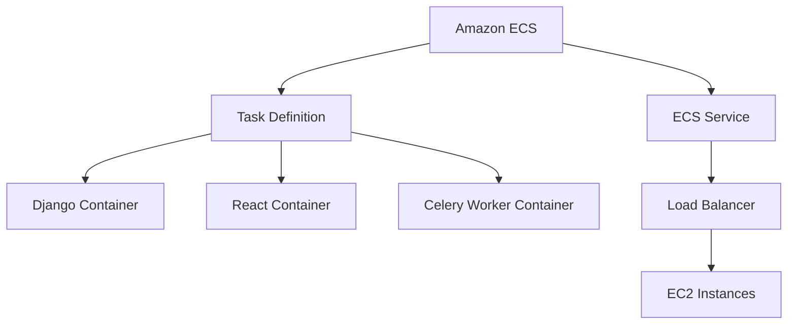

Key features of Amazon ECS:
1. Automated scaling of containers based on defined metrics
2. Integration with AWS IAM for security
3. Seamless integration with other AWS services like ECR and CloudWatch
4. Support for both EC2 and Fargate launch types

### CI/CD PIPELINE

We will implement a robust CI/CD pipeline using AWS CodePipeline in conjunction with GitHub for version control. This will ensure rapid, reliable, and consistent deployments.

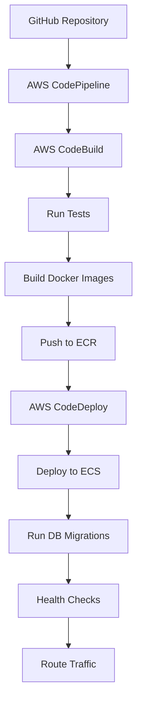

CI/CD Pipeline Stages:

1. Source Control:
   - GitHub repository for version control
   - Webhook triggers for automated pipeline execution on push events

2. Build:
   - AWS CodeBuild for compiling code and running unit tests
   - Creation of Docker images for each component

3. Test:
   - Automated testing including unit tests, integration tests, and end-to-end tests
   - Security scans and code quality checks

4. Deploy:
   - AWS CodeDeploy for managing deployments to ECS
   - Blue/Green deployment strategy for zero-downtime updates

5. Post-deployment:
   - Automated database migrations
   - Health checks to ensure successful deployment
   - Gradual traffic routing to new version

6. Monitoring:
   - Integration with AWS CloudWatch for logging and monitoring
   - Automated rollback procedures in case of deployment failures

This infrastructure setup ensures a scalable, maintainable, and efficient deployment environment for the Podcast Marketing Automation SaaS platform, aligning with the previously mentioned technology stack including React frontend, Django backend, and AI integration.